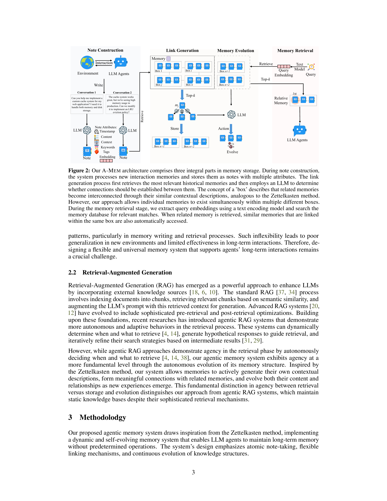
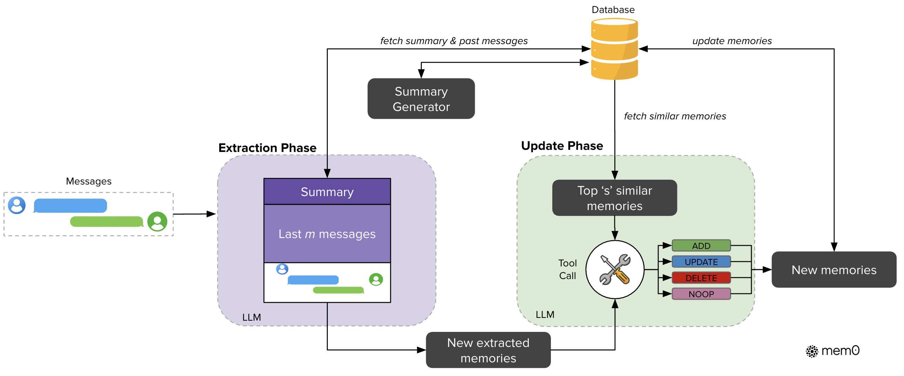
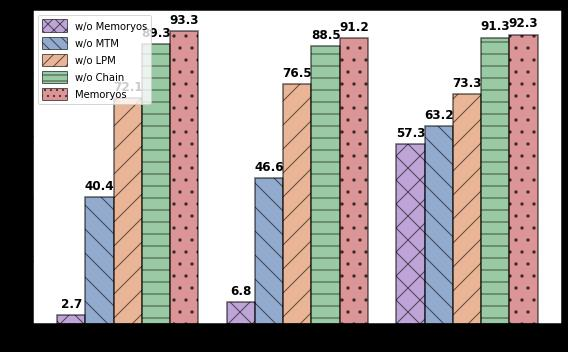
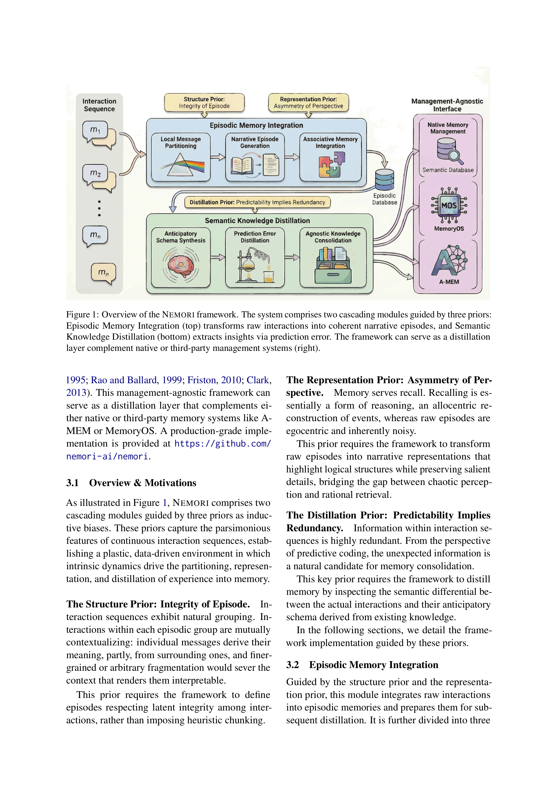

# 华为 Memory 相关论文调研：方法与实验汇总

> 本报告覆盖四篇目标论文：A-MEM、Mem0、Memory OS、NEMORI，提取每篇的核心方法流程、实验结果、会议等级，并进行综合对比分析。

---

## 目录

1. [A-MEM: Agentic Memory for LLM Agents](#1-a-mem-agentic-memory-for-llm-agents)
2. [Mem0: Building Production-Ready AI Agents with Scalable Long-Term Memory](#2-mem0-building-production-ready-ai-agents)
3. [Memory OS of AI Agent](#3-memory-os-of-ai-agent)
4. [NEMORI: What Deserves Memory](#4-nemori-what-deserves-memory)
5. [四篇论文综合对比](#5-四篇论文综合对比)
6. [与 Agent 自进化框架的关系](#6-与-agent-自进化框架的关系)

---

## 1. A-MEM: Agentic Memory for LLM Agents

### 基本信息

| 项目 | 内容 |
|------|------|
| **论文标题** | A-MEM: Agentic Memory for LLM Agents |
| **作者** | Wujiang Xu (Rutgers), Zujie Liang, Kai Mei, Hang Gao, Juntao Tan, Yongfeng Zhang |
| **发表会议** | **NeurIPS 2025** (The Thirty-ninth Annual Conference on Neural Information Processing Systems) |
| **会议等级** | **CCF-A** (人工智能顶级会议) |
| **arXiv** | 2502.12110 |
| **代码** | https://github.com/WujiangXu/A-Mem |

### 核心方法

A-MEM 受 **Zettelkasten（卡片盒笔记法）** 启发，提出一种让 LLM Agent 能够**动态组织和演化记忆**的代理式记忆系统。核心架构包含四个组件：

**1. Note Construction（笔记构建）**
- 每次交互生成结构化记忆笔记 $m_i = \{c_i, t_i, K_i, G_i, X_i, e_i, L_i\}$
- 包含：原始内容、时间戳、LLM 生成的关键词、标签、上下文描述、嵌入向量、链接集合
- 通过 LLM 分析交互内容，自动提取语义组件

**2. Link Generation（链接生成）**
- 新记忆加入时，通过语义嵌入检索 top-k 最相关历史记忆
- LLM 分析关联关系，基于共享属性自动建立连接
- 记忆可同时存在于多个"box"（类比 Zettelkasten 的卡片盒）

**3. Memory Evolution（记忆演化）**
- 新记忆集成时，**触发已有记忆的上下文描述、关键词、标签更新**
- 随着时间推移，系统自动发现更高阶的模式和概念
- 实现持续的知识结构自我优化

**4. Memory Retrieval（记忆检索）**
- 查询时通过嵌入向量相似度检索
- 支持关联记忆自动跟随（同一 box 内的记忆一起返回）



*图：A-MEM 完整架构（Figure 2 from paper），包含 Note Construction、Link Generation、Memory Evolution、Memory Retrieval 四个组件*

### 实验结果

**主实验（LoCoMo 数据集，6 个基础模型）：**

| 模型 | 方法 | Multi-Hop (F1) | Temporal (F1) | Single-Hop (F1) | Open Domain (F1) |
|------|------|:---:|:---:|:---:|:---:|
| GPT-4o-mini | A-MEM | **27.02** | **45.85** | **44.65** | 12.14 |
| GPT-4o-mini | MemGPT | 26.65 | 25.52 | 41.04 | 9.15 |
| GPT-4o | A-MEM | **32.86** | **39.41** | 48.43 | 17.10 |
| Qwen2.5-1.5B | A-MEM | **18.23** | **24.32** | **23.63** | **16.48** |
| Llama 3.2-3B | A-MEM | **17.44** | **26.38** | **28.14** | 12.53 |

- **Multi-Hop 任务达基线方法的 2 倍以上性能**
- 平均 ranking 在所有模型中排名第 1

**DialSim 数据集：**
- F1=3.45 (vs LoCoMo 2.55, MemGPT 1.18，提升 35%/192%)

**消融实验（GPT-4o-mini）：**

| 配置 | Multi-Hop F1 | Temporal F1 | Open Domain F1 |
|------|:---:|:---:|:---:|
| w/o LG & ME (无链接+演化) | 9.65 | 24.55 | 7.77 |
| w/o ME (仅链接) | 21.35 | 31.24 | 10.13 |
| Full A-MEM | **27.02** | **45.85** | **12.14** |

**成本效率：**
- 每次记忆操作约 1,200 tokens，比 MemGPT/LoCoMo（16,900 tokens）减少 **85-93%**
- 每次操作成本 < $0.0003（商用 API）
- 100 万条记忆时检索时间仅 3.70µs

**扩展性分析：**
- 1K→1M 记忆，检索时间从 0.31µs 仅增至 3.70µs
- 空间复杂度 O(N)，与基线无异

---

## 2. Mem0: Building Production-Ready AI Agents

### 基本信息

| 项目 | 内容 |
|------|------|
| **论文标题** | Mem0: Building Production-Ready AI Agents with Scalable Long-Term Memory |
| **作者** | Prateek Chhikara, Dev Khant, Saket Aryan, Taranjeet Singh, Deshraj Yadav |
| **发表会议** | **arXiv 预印本** (2025-04-28)，暂未见顶会接收 |
| **会议等级** | **未收录**（工业界产品论文，Mem0 为商业产品） |
| **arXiv** | 2504.19413 |
| **代码/产品** | https://mem0.ai |

### 核心方法

Mem0 提出两套互补的记忆架构：

#### 2.1 Mem0（基础版）

**Extraction Phase（提取阶段）：**
- 输入：当前消息对 $(m_{t-1}, m_t)$ + 对话摘要 $S$ + 最近 $m$ 条消息
- LLM 从新消息中提取一组**关键事实** $\Omega = \{\omega_1, ..., \omega_n\}$

**Update Phase（更新阶段）：**
- 对每个候选事实，检索 top-$s$ 语义相似记忆
- LLM 通过 Tool Call 决定四种操作之一：
  - **ADD**：不存在相似记忆时新建
  - **UPDATE**：增强已有记忆
  - **DELETE**：新信息与已有冲突时删除
  - **NOOP**：无需修改

#### 2.2 Mem0^g（图增强版）

- 记忆表示为有向标注图 $G=(V,E,L)$
- 节点 = 实体（含类型、嵌入向量、时间戳）
- 边 = 关系三元组 $(v_s, r, v_d)$
- **两阶段提取**：实体提取器 → 关系生成器
- **冲突检测机制**：标记过时关系而非物理删除
- **双路检索**：实体中心 + 语义三元组



*图：Mem0 完整流水线架构，展示 Extraction 和 Update 两阶段*

### 实验结果

**主实验（LoCoMo 数据集，GPT-4o-mini）：**

| 方法 | Single-Hop (J) | Multi-Hop (J) | Temporal (J) | Open Domain (J) | Overall J |
|------|:---:|:---:|:---:|:---:|:---:|
| A-Mem* | 39.79 | 18.85 | 49.91 | 54.05 | 48.38 |
| LangMem | 62.23 | 47.92 | 23.43 | 71.12 | 58.10 |
| Zep | 61.70 | 41.35 | 49.31 | **76.60** | 65.99 |
| OpenAI | 63.79 | 42.92 | 21.71 | 62.29 | 52.90 |
| **Mem0** | **67.13** | **51.15** | 55.51 | 72.93 | 66.88 |
| **Mem0^g** | 65.71 | 47.19 | **58.13** | 75.71 | **68.44** |

**延迟分析：**

| 方法 | Search p95 (s) | Total p95 (s) | Overall J |
|------|:---:|:---:|:---:|
| Full-context | - | 17.117 | **72.90** |
| **Mem0** | **0.200** | **1.440** | 66.88 |
| Mem0^g | 0.657 | 2.590 | 68.44 |
| A-Mem | 1.485 | 4.374 | 48.38 |
| LangMem | 59.82 | 60.40 | 58.10 |

- Mem0 相比 Full-context：**p95 延迟降低 91%，token 成本节省 90%+**
- J 分数仅比 Full-context 低约 5 个点

**Token 预算分析：**
- Mem0 每对话仅需 7K tokens（vs Full-context 26K, Zep >600K）
- Mem0^g 约 14K tokens

**关键发现：**
- Mem0 在 Single-Hop 和 Multi-Hop 最优
- Mem0^g 在 Temporal 和 Open Domain 最优
- 图结构对需要关系推理的任务增益明显

---

## 3. Memory OS of AI Agent

### 基本信息

| 项目 | 内容 |
|------|------|
| **论文标题** | Memory OS of AI Agent |
| **作者** | Jiazheng Kang (北邮), Mingming Ji (腾讯AI Lab), Zhe Zhao (腾讯AI Lab), Ting Bai (北邮) |
| **发表会议** | **EMNLP 2025** (Proceedings of the 2025 Conference on Empirical Methods in Natural Language Processing) |
| **会议等级** | **CCF-B** (自然语言处理顶级会议之一) |
| **arXiv** | 2506.06326 |
| **代码** | https://github.com/BAI-LAB/MemoryOS |

### 核心方法

MemoryOS 受**操作系统内存管理原理**启发，设计分层记忆架构和四大核心模块：

**Memory Storage（三层存储架构）：**

| 层级 | 名称 | 存储内容 | 结构 |
|------|------|---------|------|
| STM | 短期记忆 | 实时对话页 (dialogue pages) | FIFO 队列，含对话链 |
| MTM | 中期记忆 | 按主题组织的段-页结构 | 分段分页存储，含 heat 评分 |
| LPM | 长期个性化记忆 | 用户/Agent 画像、知识库、特征 | User Persona + Agent Persona |

**Memory Updating（动态更新）：**
- **STM→MTM**：对话链 FIFO 迁移，新页追加到队列尾
- **MTM 内部**：段内页通过语义+关键词相似度（$F_{score}$）合并
- **Heat 评分机制**：$Heat = \alpha \cdot N_{visit} + \beta \cdot L_{interaction} + \gamma \cdot R_{recency}$
  - 低 heat 段被驱逐，高 heat 段迁移至 LPM
- **MTM→LPM**：heat 超过阈值 $\tau$ 的段转至长期存储
- **LPM 更新**：提取用户特征（90 维）、用户知识库、Agent 特征

**Memory Retrieval（两级检索）：**
- STM：返回全部对话页（最近上下文）
- MTM：先选 top-m 段 → 再选段内 top-k 页
- LPM：语义相似度 top-10 用户知识/Agent 特征

**Response Generation：**
- 整合 STM + MTM + LPM 检索结果，构造 prompt



*图：MemoryOS 整体架构，包含 STM/MTM/LPM 三层及四大功能模块*

### 实验结果

**主实验（GVD 数据集，GPT-4o-mini）：**

| 方法 | Accuracy ↑ | Correctness ↑ | Coherence ↑ |
|------|:---:|:---:|:---:|
| TiM | 84.5 | 78.8 | 90.8 |
| MemoryBank | 78.4 | 73.3 | 91.2 |
| MemGPT | 87.9 | 83.2 | 89.6 |
| A-Mem | 90.4 | 86.5 | 91.4 |
| **MemoryOS** | **93.3** | **91.2** | **92.3** |
| Improvement | +3.2% | +5.4% | +1.0% |

**主实验（LoCoMo 数据集，GPT-4o-mini）：**

| 方法 | Single Hop F1 | Multi Hop F1 | Temporal F1 | Open Domain F1 | Avg Rank (F1) |
|------|:---:|:---:|:---:|:---:|:---:|
| TiM | 16.25 | 18.43 | 8.35 | 23.74 | 3.8 |
| MemoryBank | 5.00 | 9.68 | 5.56 | 6.61 | 5.0 |
| MemGPT | 26.65 | 25.52 | 9.15 | 41.04 | 2.2 |
| A-Mem* | 22.61 | 33.23 | 8.04 | 34.13 | 3.0 |
| **MemoryOS** | **35.27** | **41.15** | **20.02** | **48.62** | **1.0** |
| Improvement | +32.35% | +23.83% | +118.80% | +18.47% | - |

- **平均 F1 提升 49.11%，BLEU-1 提升 46.18%**

**效率分析：**

| 方法 | Avg Tokens | Avg LLM Calls | Avg F1 |
|------|:---:|:---:|:---:|
| MemoryBank | 432 | 3.0 | 6.84 |
| TiM | 1,274 | 2.6 | 18.01 |
| MemGPT | 16,977 | 4.3 | 29.13 |
| A-Mem* | 2,712 | 13.0 | 26.55 |
| **MemoryOS** | 3,874 | **4.9** | **36.23** |

**消融实验：**
- 移除 MTM → 性能大幅下降（最大影响）
- 移除 LPM → 性能中等下降
- 移除 Chain → 影响最小但仍显著
- 移除全部 MemoryOS → 性能崩溃

---

## 4. NEMORI: What Deserves Memory

### 基本信息

| 项目 | 内容 |
|------|------|
| **论文标题** | What Deserves Memory: Adaptive Memory Distillation for LLM Agents |
| **作者** | Wenquan Ma (复旦/上财), Jiayan Nan (盛大集团), Wenlong Wu (北航), Yize Chen (盛大集团) |
| **发表会议** | **arXiv 预印本** (v4: 2026-04-16)，文中致谢"anonymous reviewers"暗示正在审稿中 |
| **会议等级** | **待定**（可能投稿至 2026 年顶会） |
| **arXiv** | 2508.03341 |
| **代码** | https://github.com/nemori-ai/nemori |

### 核心方法

NEMORI 受 **Predictive Coding Theory（预测编码理论）** 启发，提出一个**管理无关的自适应记忆蒸馏框架**，核心问题是"**什么值得被记住**"。

**三大先验（Priors）：**

| 先验 | 内容 | 设计含义 |
|------|------|---------|
| Structure Prior | 交互序列具有自然的片段完整性 | 按潜在语义边界划分 episode，不做机械分块 |
| Representation Prior | 视角不对称性：回忆是 allocentric 重构 | 将原始 egocentric 交互转为叙事表征 |
| Distillation Prior | 可预测 = 冗余 | **预测误差**作为应保留信息的信号 |

**两大级联模块：**

#### 4.1 Episodic Memory Integration（情景记忆整合）

- **Local Message Partitioning**：LLM 按语义边界将消息划分为 episode（非固定窗口）
- **Narrative Episode Generation**：将每个 episode 转为叙事表征 + 语义 cue
- **Associative Memory Integration**：检查是否与已有 episode 连续，动态合并

#### 4.2 Semantic Knowledge Distillation（语义知识蒸馏）

- **Anticipatory Schema Synthesis**：基于已有知识预测当前 episode 内容
- **Prediction Error Distillation**：**提取预测错误的部分作为语义 insight**
- **Agnostic Knowledge Consolidation**：三种操作（new / merge / conflict）写入管理后端

**管理无关设计：**
- 蒸馏层通过 `Evoke()` 和 `Consolidate()` 抽象接口与任意管理系统对接
- 原生提供简单语义 DB + 冲突检测/合并逻辑
- 已验证可与 A-MEM 和 MemoryOS 集成



*图：NEMORI 完整框架（Figure 1 from paper），包含 Episodic Memory Integration（上）和 Semantic Knowledge Distillation（下）两个级联模块。*

### 实验结果

**主实验（LoCoMo 数据集）：**

*GPT-4.1-mini：*

| 方法 | Temporal (LLM) | Multi-Hop (LLM) | Single-Hop (LLM) | Open Domain (LLM) | **Avg LLM** |
|------|:---:|:---:|:---:|:---:|:---:|
| Full Context | 74.2 | 77.2 | 86.9 | 56.6 | 80.6 |
| LangMem | 50.8 | 71.0 | 84.5 | 59.0 | 73.4 |
| Mem0 | 56.9 | 68.2 | 71.4 | 47.9 | 66.3 |
| A-MEM | 66.7 | 55.7 | 64.0 | 37.5 | 61.4 |
| MemoryOS | 37.7 | 62.4 | 68.9 | 60.4 | 60.6 |
| **NEMORI** | **77.3** | 74.8 | **87.0** | 56.3 | **80.8** |
| *vs strongest memory* | *+15.9%* | *+5.4%* | *+3.0%* | *-6.8%* | *+10.1%* |

*GPT-4o-mini：*

| 方法 | **Avg LLM** |
|------|:---:|
| Full Context | 72.3 |
| Mem0 | 61.3 |
| MemoryOS | 54.5 |
| A-MEM | 52.5 |
| **NEMORI** | **73.0** |
| *vs strongest memory* | *+19.1%* |

- NEMORI **略超 Full Context**（80.8 vs 80.6 / 73.0 vs 72.3），是首个**不依赖完整上下文却能超越完整上下文**的方法
- **Temporal Reasoning 尤其突出**：GPT-4.1-mini 上 +15.9% over best memory baseline

**效率分析（LoCoMo, GPT-4o-mini）：**

| 方法 | LLM Calls | 总 Tokens | Avg LLM |
|------|:---:|:---:|:---:|
| Mem0 | 1,602 | 1,693k | 61.3 |
| A-MEM | 1,176 | 1,149k | 52.5 |
| MemoryOS | 1,016 | 527k | 54.5 |
| **NEMORI** | **373** | **323k** | **73.0** |
| *Improvement* | *-59.5%* | *-38.7%* | |

- 响应生成时 token 用量 2,745（vs Full Context 23,653，**减少 88%**）
- 总延迟 3,053ms（vs Full Context 5,806ms，**降低 47%**）

**第三方集成（为 A-MEM 和 MemoryOS 提供蒸馏层）：**

| 系统 | 输入 | LLM Score | Memory Tokens |
|------|------|:---:|:---:|
| A-MEM | Raw Messages (P) | 52.5 | 397K |
| A-MEM | **NEMORI Semantic (K)** | 50.9 | 142K (**-64.3%**) |
| MemoryOS | Raw Messages (P) | 54.6 | 405K |
| MemoryOS | **NEMORI Semantic (K)** | 54.0 | 190K (**-53.1%**) |

- 存储减少 45-64%，核心性能基本持平（±4%），核心分数提升 +1.9% ~ +6.1%

**扩展性（LongMemEvalS，105K tokens，10x LoCoMo）：**

| 模型 | Full Context (101K tok) | NEMORI (3.7-4.8K tok) |
|------|:---:|:---:|
| GPT-4o-mini | 55.0 | **64.2** (+16.7%) |
| GPT-4.1-mini | 65.6 | **74.6** (+13.7%) |

- 上下文越长，NEMORI 优势越明显

**消融实验：**
- 移除 episodic 检索：-11.0% (gpt-4o-mini)
- 移除 semantic 检索：-25.1% (gpt-4o-mini)
- 直接蒸馏 vs 预测误差蒸馏：预测误差版 +25.0%
- 移除自适应分区（固定 20 消息分块）：-4~6%

---

## 5. 四篇论文综合对比

### 5.1 方法论对比

| 维度 | A-MEM | Mem0 | Memory OS | NEMORI |
|------|-------|------|-----------|--------|
| **核心思想** | Zettelkasten 卡片盒笔记法 | 增量提取+语义更新 | OS 内存管理（分段分页） | 预测编码（预测误差驱动） |
| **记忆组织** | 互联笔记网络（图） | 向量+图（双存储） | 三层分层 (STM/MTM/LPM) | Episode→Semantic 两级 |
| **记忆更新** | 链接生成 + 记忆演化 | ADD/UPDATE/DELETE/NOOP | Heat-based + FIFO 迁移 | 预测误差蒸馏 + 整合 |
| **检索机制** | 语义相似度 + Box 跟随 | 语义+实体双路 | Segment→Page 两级 | Episodic + Semantic 双路 |
| **人格/偏好** | 无显式建模 | 无显式建模 | 90 维用户特征 + KB | 隐式嵌入语义记忆 |
| **管理无关** | 否 | 否 | 否 | **是（核心创新）** |
| **生产就绪** | 开源系统可用 | **商业产品** | 开源代码 | 开源+可集成第三方 |

### 5.2 性能对比（LoCoMo 数据集）

| 方法 | 会议 | Multi-Hop | Temporal | Single-Hop | Open Domain | 核心优势 |
|------|:---:|:---:|:---:|:---:|:---:|------|
| A-MEM | **NeurIPS'25** | F1=27.0 | F1=45.9 | F1=44.7 | F1=12.1 | Multi-Hop 2x 提升 |
| Mem0 | arXiv | J=51.2 | J=55.5 | J=67.1 | J=72.9 | 91%延迟降低 |
| Memory OS | **EMNLP'25** | F1=41.2 | F1=20.0 | F1=35.3 | F1=48.6 | +49% F1 提升 |
| NEMORI | arXiv | J=74.8 | **J=77.3** | **J=87.0** | J=56.3 | 超越 Full Context |

> 注：不同论文使用的评估指标不完全一致（F1/BLEU vs LLM-as-Judge），上表仅展示各方法在其自身论文中报告的核心优势指标，横向对比仅供参考。

### 5.3 效率对比

| 方法 | 构建 LLM Calls | Token 开销/对话 | p95 延迟 | 扩展到 1M 记忆 |
|------|:---:|:---:|:---:|:---:|
| A-MEM | ~13 | ~2,500 | 4.4s | **检索 3.7µs** |
| Mem0 | 中 | 7K (base) / 14K (graph) | **1.4s** | - |
| Memory OS | 4.9 | 3,874 | - | - |
| NEMORI | **373** (全对话) | **323K** (全对话) | 3.1s | - |

### 5.4 会议等级汇总

| 论文 | 发表会议/状态 | CCF 等级 | 备注 |
|------|:---:|:---:|------|
| **A-MEM** | NeurIPS 2025 | **CCF-A** | 人工智能领域顶级会议 |
| **Mem0** | arXiv 预印本 | 未收录 | 工业产品(Mem0.ai)，关注工程实用性 |
| **Memory OS** | EMNLP 2025 | **CCF-B** | 自然语言处理领域顶级会议 |
| **NEMORI** | arXiv 预印本 | 待定 | 文中致谢匿名审稿人，暗示在审 |

---

## 6. 与 Agent 自进化框架的关系

四篇论文从不同角度解决了 **Agent 记忆机制**的关键问题，它们与 Agent 自进化框架的关系如下：

### 6.1 记忆在自进化中的角色定位

```
Agent 自进化 = 经验积累 + 知识抽象 + 策略优化
                ↑              ↑            ↑
              Memory  ←→   Distillation  ←→ Reasoning
```

- **A-MEM** 和 **Memory OS** 侧重于记忆的**组织与管理**（如何存储和检索），为自进化提供基础记忆设施
- **Mem0** 侧重于记忆的**生产化部署**（效率与扩展性），使自进化系统能规模化运行
- **NEMORI** 直接触及自进化的核心问题——**"什么值得记忆"**，通过预测误差实现数据驱动的经验筛选

### 6.2 对自进化框架的贡献

| 论文 | 对自进化的核心贡献 |
|------|------|
| **A-MEM** | 记忆的**自主演化**能力——新经历可以反向更新已有记忆的上下文表征，实现知识结构随时间不断完善 |
| **Mem0** | **冲突检测与更新**机制——ADD/UPDATE/DELETE 操作使记忆随新信息保持一致，是自进化的基本操作单元 |
| **Memory OS** | **分层记忆 + Heat 驱动更新**——模拟人类从 STM→LTM 的巩固过程，热数据自动升级为长期个性记忆 |
| **NEMORI** | **预测误差驱动的蒸馏**——最接近认知科学中"惊讶→学习"的自进化范式，避免启发式偏差，实现数据驱动的经验价值评估 |

### 6.3 自进化框架中记忆组件的理想设计方向

综合四篇论文的启示，Agent 自进化框架中的理想 Memory 组件应具备：

1. **动态结构化**（A-MEM）：记忆组织应随经验积累而自动演化，而非固化于预定义结构
2. **分层管理**（Memory OS）：借鉴认知科学和 OS 设计，短/中/长期记忆分层存储和迁移
3. **可扩展生产**（Mem0）：关注延迟和 token 成本，支持图+向量混合存储
4. **数据驱动蒸馏**（NEMORI）：以预测误差而非启发式规则作为"值得记忆"的判据

NEMORI 的**管理无关蒸馏层**设计尤其值得整合——它可作为自进化框架的前端，自动筛选有价经验后再存入 A-MEM 或 Memory OS 等后端系统，实现"蒸馏+管理"的松耦合。

---

> **生成日期**：2026-05-04 | **数据来源**：四篇论文全文（从本地 PDF 通过 pdftotext 提取文本，pdfimages 提取图片）
